# Máquina: Library

**Tryhackme: Library**

# NMAP

Lanzamos el comando de reconocimiento y sacamos la siguiente información:

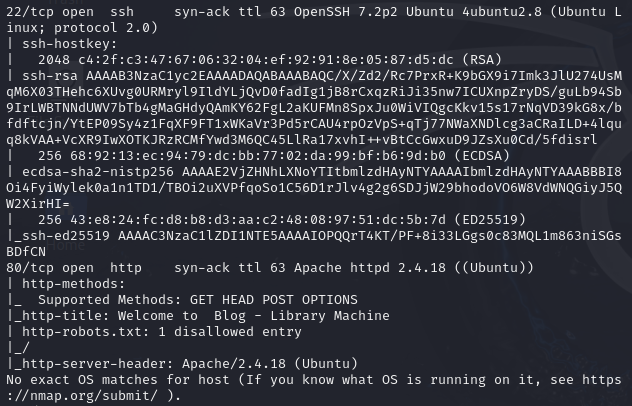

Como observamos en la imagen anterior, existen varios servicios que nos pueden interesar:

- Puerto 22 (SSH)
- Puerto 80 (HTTP)

# Enumeración: Puerto 80

Si nos dirigimos a la página web expuesta, nos encontraremos con lo que parece ser un blog.

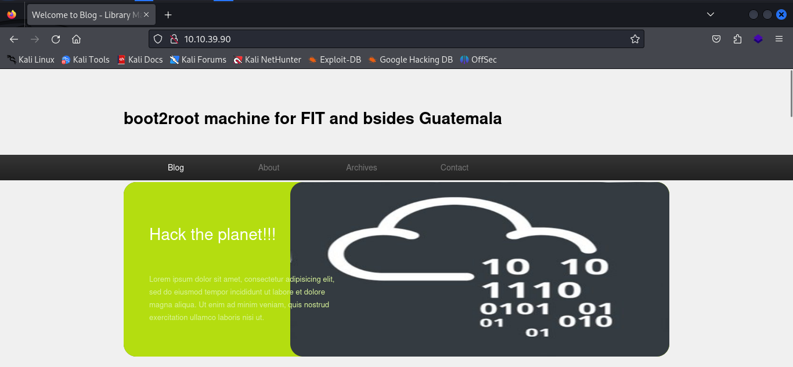

Si indagamos un poco por los distintos apartados de la página, nos podremos encontrar algunos comentarios realizados por usuarios del sistema:

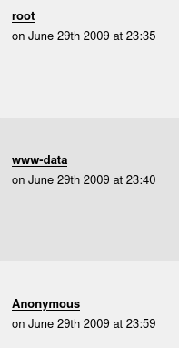

# Explotación: Puerto 22

De los usuarios encontrados anteriormente, nos interesaremos por el llamado: Meliodas.

A continuación, vamos a utilizar la herramienta Hydra para realizar una fuerza bruta al servicio SSH para ver si conseguimos sacar la contraseña del usuario mencionado anteriormente.

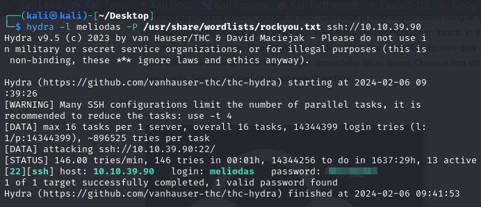

Como observamos en la imagen anterior, encontramos la contraseña del usuario Meliodas. Ahora lo que haremos será acceder al sistema objetivo por SSH con las credenciales que tenemos.

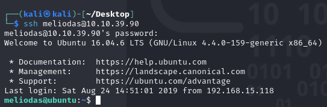

# Flag: user.txt

En el "home" del usuario "meliodas" encontraremos la flag del usuario:

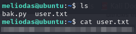

# Flag: root.txt

Para encontrar la flag de "root", necesitaremos escalar privilegios en el sistema objetivo. Para ello, realizaremos primeramente un "sudo -l" para ver qué comandos puede ejecutar el usuario como "root".

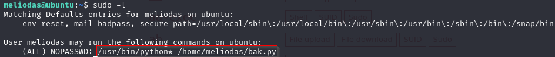

Como se observa en la imagen anterior, el usuario puede ejecutar el comando "python" y el fichero "bak.py" como administrador.

Si hacemos un "ls" en el "home" del usuario, veremos que el fichero "bak.py" se encuentra en su interior.

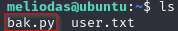

A continuación, vamos a crear una copia de dicho fichero, ya que el sistema no nos dejarán ingresarle ninguna línea utilizando "echo".

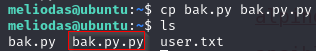

Una vez copiado, eliminaremos el original y le pondremos a la copia el nombre del fichero original.

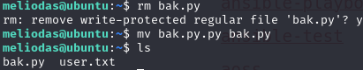

Ahora utilizaremos el comando "echo" para introducir un payload que nos creará una shell una vez ejecutemos el fichero "bak.py" como administrador.

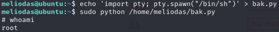

Por último, nos iremos al directorio "/root" para buscar la flag y listarla.

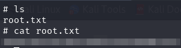
